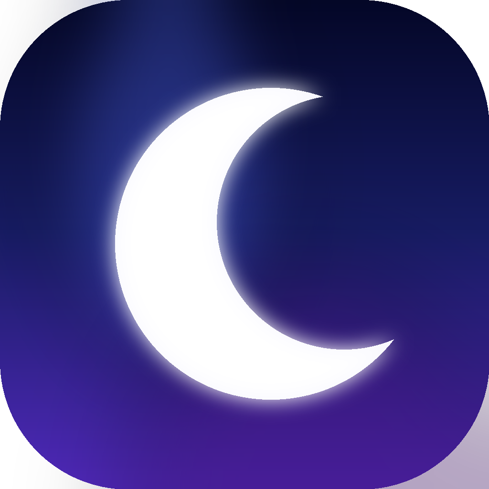

    
    <h1>Kaguya</h1>
    

        The Chromium-based web browser made for people, with love.
         
        Privacy-first with unbiased ad-blocking. No bloat and no noise.
    

    <a href="https://kaguya.computer/">
        kaguya.computer
    </a>

## Downloads
> [!NOTE]
> Kaguya is currently in beta, so unexpected issues may occur.
> Please report them if they haven't already been reported.

The easiest way to download Kaguya is [kaguya.computer](https://kaguya.computer/).
It'll pick a compatible binary for your platform automatically.

The same releases can also be downloaded from source on GitHub:

- [Latest macOS release](https://github.com/iceice666/kaguya-macos/releases/latest)
- [Latest Linux release](https://github.com/iceice666/kaguya-linux/releases/latest)
- Windows — planned, not yet available

## Kaguya repos
All Kaguya packaging, tooling, services, and components are open source
and published on GitHub.

### Platform packaging and tooling
- [Kaguya for macOS](https://github.com/iceice666/kaguya-macos)
- [Kaguya for Linux](https://github.com/iceice666/kaguya-linux)
- Kaguya for Windows — planned, not yet available

### Web services and Kaguya components
- [Kaguya services](https://github.com/iceice666/kaguya-services)
- [Kaguya fork of uBlock Origin](https://github.com/iceice666/uBlock)

## Development
Linux is our active development platform, so it's the recommended
environment for community contributions.

macOS packaging includes a similar development script, so the same guide
can be applied there too.

[> See development docs in the Linux repo](https://github.com/iceice666/kaguya-linux#readme)

## Contributing
Before contributing to Kaguya, please read the guidelines in
[CONTRIBUTING.md](CONTRIBUTING.md).

## Credits

### The Chromium project
[The Chromium Project](https://www.chromium.org/) is at the core of Kaguya,
making it possible in the first place.

### ungoogled-chromium
Kaguya builds on [ungoogled-chromium](https://github.com/ungoogled-software/ungoogled-chromium),
but is heavily modified. Special thanks to everyone behind ungoogled-chromium,
they made working with Chromium way easier.

### Helium
Kaguya was forked from [Helium](https://github.com/imputnet/helium-chromium), and
much of the shared patchset, tooling, and resource pipeline originated there.
Thanks to the Helium authors for the foundation this project was built on.

### Other Chromium browsers

Kaguya includes some patches from other open source Chromium browsers:

- [Inox patchset](https://github.com/gcarq/inox-patchset)
- [Debian](https://tracker.debian.org/pkg/chromium-browser)
- [Bromite](https://github.com/bromite/bromite)
- [Iridium Browser](https://iridiumbrowser.de/)
- [Brave](https://github.com/brave/brave-core)

All patches are sorted by vendor in the [patches](patches/) directory of this repo.

## License
All code, patches, modified portions of imported code or patches, and
any other content that is unique to Kaguya and not imported from other
repositories is licensed under GPL-3.0. See [LICENSE](LICENSE).

Any content imported from other projects retains its original license (for
example, any original unmodified code imported from ungoogled-chromium remains
licensed under their [BSD 3-Clause license](LICENSE.ungoogled_chromium)).
